# Sales Forecasting with Facebook Prophet

---
  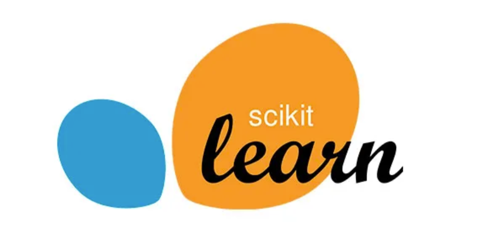  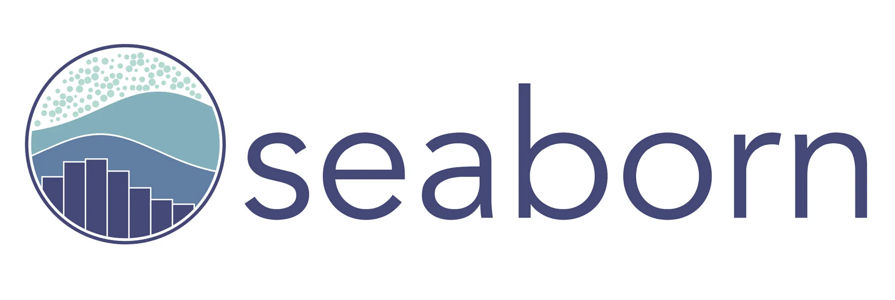  

## Introduction
This project focuses on using data science to address a key challenge in business sales. It involves building a Python model using Facebook Prophet, a powerful tool for time series forecasting, to provide accurate predictions that can help optimize business strategies.

## Problem Statement
This project addresses the problem by developing a machine learning model that forecasts the future sales of different stores of a brand. The main idea is to predict how good or bad is the near future and be prepared for it.

## Background
- Libraries and datasets
- Visualize dataset
- Data cleaning and transformation
- Exploratory Data Analysis (EDA)
- Merge Datasets Analysis
- Prediction Model (Facebook Prophet)
- Final Predictions with Holidays

## Models Used
- Facebook Prophet

## Data Sourcing
The dataset used in this project is a cleaned version of information extracted from the internet. 

## Data Cleaning and Exploration
The data was previously cleaned with a first ETL process, the changed made here were:
1) To discard closed stores.
2) To drop column "Open"
3) To convert to zero all missing data in columns Promo2SinceWeek, Promo2SinceYear, PromoInterval, CompetitionOpenSinceYear, CompetitionOpenSinceMonth.
4) To fill missing data in CompetitionDistance with the mean.

## Exploratory Data Analysis (EDA)
In this part, the principal objective was to visualize data with histograms for a better understanding of the variation and distribution in each feature.
  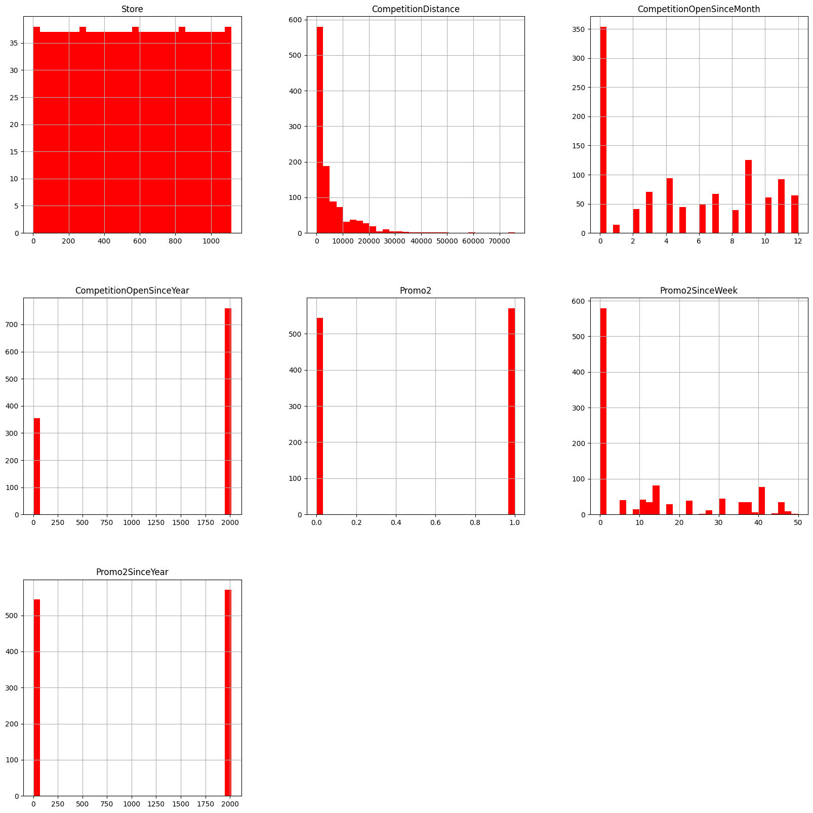

# Merge Datasets and Analysis
In this step, the principal issue was to merge both datasets, sales df with stores information df, and visualize how this data behave after that.
For example, seeing the correlations we can determine that:
- Sales is strongly correlated with Customers(first), Promo(second) and SchoolHoliday(third, negative)
- Promo is strongly dependient of Customers, SchoolHoliday and DayOfWeek.
  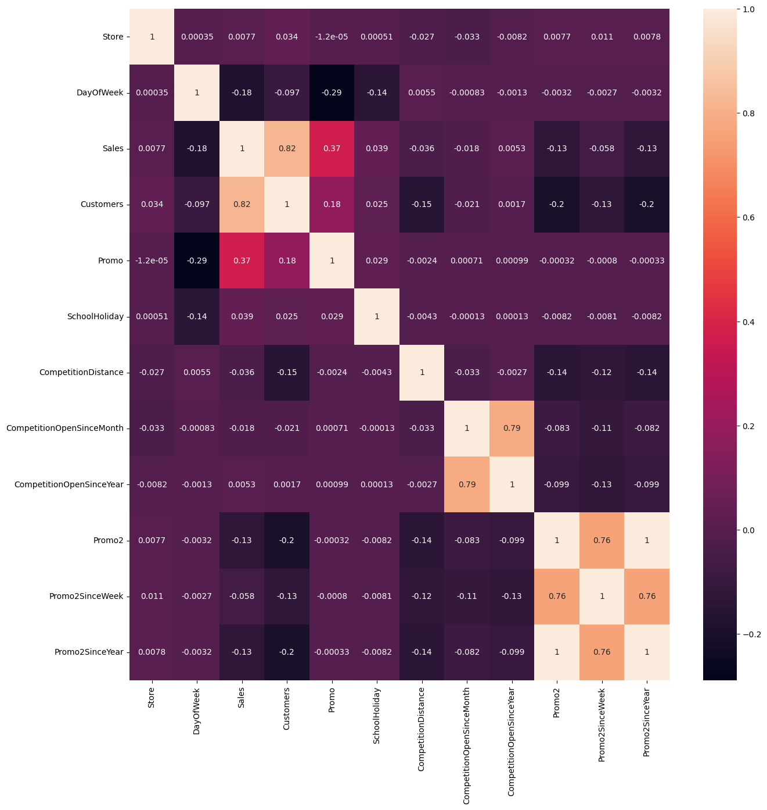
On the other hand, let's look at the variation of Sales average across the time:
- Per month

  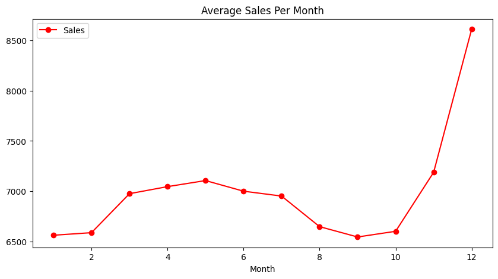

- Per day of month

  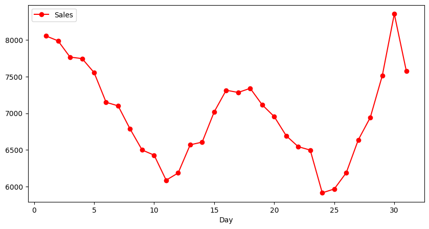

The high season is november-december, the start-middle-end of the months are the most important part of each one.

  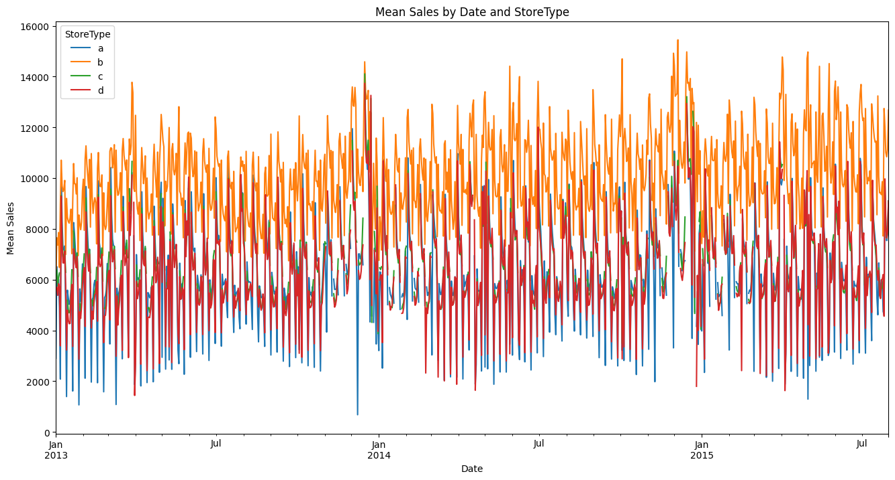

There is a tendency towards slight growth across the months, for all stores.

  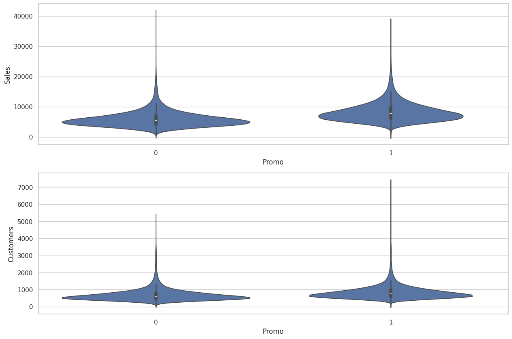

It can be observed that sales are more concentrated on days with promotions.

# Final Prediction with and without Holidays
Library used: Facebook Prophet.
Holidays are from both school and state.

Prediction Without Holidays      |        Prediction With Holidays
:---------:|:----------:
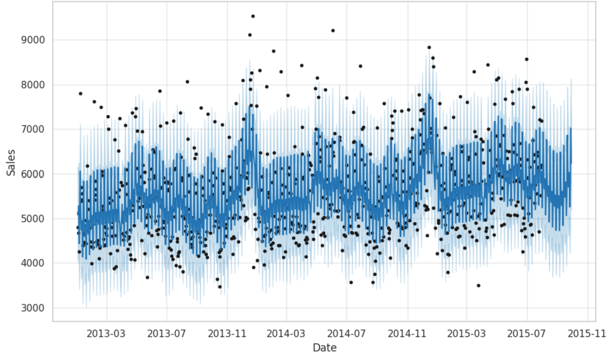         |   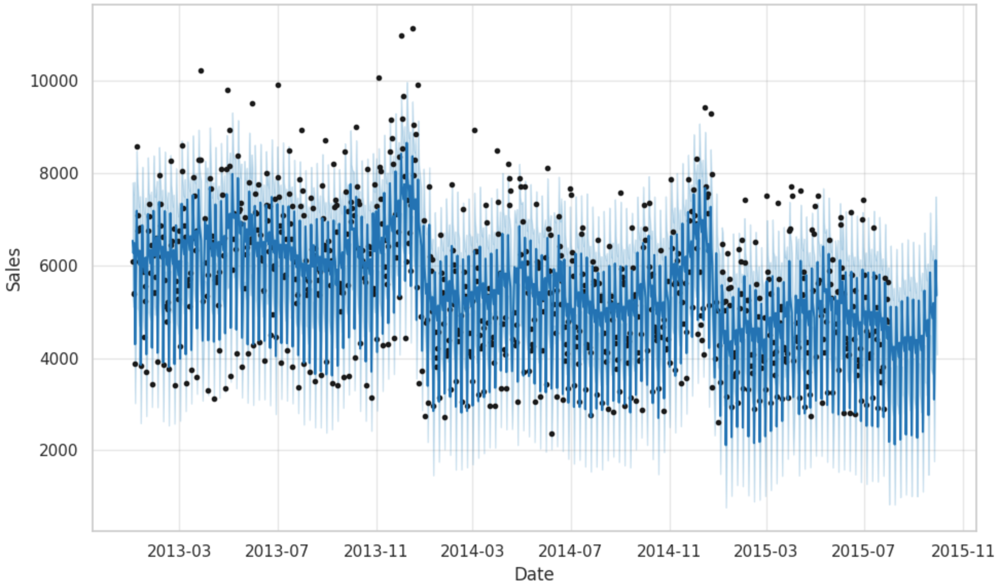      

Trend Without Holidays      |        Trend With Holidays
:---------:|:----------:
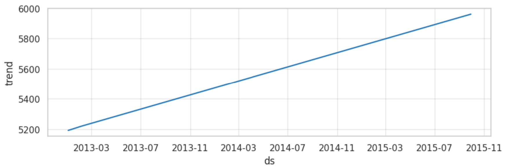         |   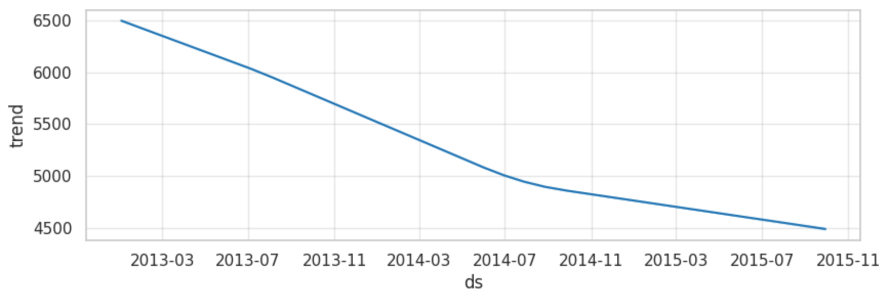   

# Conclusion
The decline in sales with holidays incorporated into the model seems to reflect a realistic pattern. It’s natural for sales to decrease following some periods, but in this case the final tendency is not good. The possible solution might be to add more Promotion days and to optimize the use of these.
